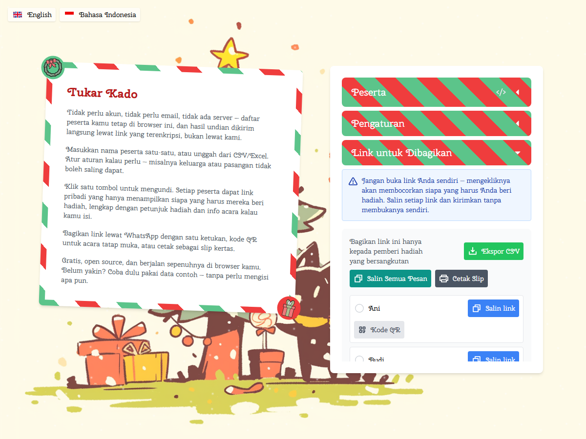

# Tukar Kado 🎄

**[Coba sekarang di bukanpawkemon.github.io/tukar-kado](https://bukanpawkemon.github.io/tukar-kado/)**

Alat gratis untuk bikin undian tukar kado (Secret Santa) online — tanpa
daftar, tanpa email, tanpa akun. Daftar peserta kamu tetap di browser, dan
hasil undian dikirim langsung lewat link yang terenkripsi, bukan lewat kami.



## Kenapa ini beda

Kebanyakan alat undian nama minta kamu login, memasukkan email semua orang,
atau menyimpan datanya di server mereka. Tukar Kado tidak melakukan itu:

- **Tidak ada backend.** Ini murni aplikasi yang jalan di browser. Tidak ada
  server yang menyimpan siapa dapat siapa.
- **Setiap link terenkripsi sendiri-sendiri.** Saat kamu klik "Hasilkan
  Pasangan", setiap peserta dapat kunci enkripsi acak untuk acara itu. Hasil
  pasangannya dikemas dan dienkripsi ke dalam link itu sendiri — bukan
  disimpan di suatu tempat yang bisa diakses orang lain.
- **Link-nya aman dibagikan lewat chat.** Data pasangan ada di bagian `#`
  URL (fragment), bagian yang secara teknis tidak pernah dikirim ke server
  mana pun — termasuk saat WhatsApp atau Telegram menampilkan pratinjau link
  yang kamu kirim.
- **Halaman pembukaan dua tahap.** Saat peserta membuka link-nya, nama
  pasangannya *tidak* langsung muncul di layar — mereka harus mengetuk kotak
  hadiah dulu. Jadi tidak ada risiko ke-spoiler cuma dari melirik layar.

Baca detail teknisnya di [`CLAUDE.md`](CLAUDE.md).

## Fitur

- Tambah peserta manual, lewat format teks singkat, atau impor dari CSV/Excel
  (deteksi kolom otomatis, header Indonesia atau Inggris)
- Aturan pasangan: paksa pasangan tertentu, larang pasangan tertentu, atau
  kelompokkan (misal keluarga) supaya otomatis tidak saling dapat
  — semua diselesaikan dengan algoritma matching yang presisi, jadi kalau
  ada kombinasi yang valid pasti ketemu, dan kalau tidak ada, kamu dapat
  alasan spesifiknya
- Kirim link lewat WhatsApp dengan satu ketukan, kode QR untuk acara tatap
  muka, atau cetak sebagai slip kertas
- Info acara opsional: nama acara, tanggal, batas waktu, kisaran anggaran,
  dan link wishlist per peserta
- Cadangkan/pulihkan seluruh acara sebagai satu file — berguna kalau data
  browser kamu terhapus
- Bahasa Indonesia dan Inggris, masing-masing di URL sendiri

## Menjalankan secara lokal

Proyek ini pakai [Yarn Berry](https://yarnpkg.com/) (`yarn@4.5.1`).

```bash
yarn              # install dependencies
yarn dev          # jalankan dev server
yarn build        # build untuk produksi
yarn vitest       # jalankan test
```

Detail arsitektur dan konvensi kode ada di [`CLAUDE.md`](CLAUDE.md).

## English

Tukar Kado ("gift exchange" in Indonesian) is a free Secret Santa /
gift-exchange generator — no signup, no email, no account. **Live at
[bukanpawkemon.github.io/tukar-kado](https://bukanpawkemon.github.io/tukar-kado/)**
(English available at [`/en/`](https://bukanpawkemon.github.io/tukar-kado/en/)).

It's fully client-side: there's no backend, and no server ever sees who's
been paired with whom. Each pairing round gets its own random encryption
key; every participant's assignment is packed and encrypted directly into
their unique link, using the URL fragment (the part after `#`) specifically
because browsers never transmit that part to a server — including when
WhatsApp or Telegram fetch a link preview. See [`CLAUDE.md`](CLAUDE.md) for
the full technical write-up.

Add participants manually, via a compact text format, or by importing a
CSV/Xlsx file with automatic column detection. Set pairing rules — force or
prevent specific pairings, or tag participants into groups (a family, a
couple) that should never draw each other. Share links over WhatsApp, QR
code, or printed slips. The reveal page is two-stage on purpose: a
participant's match never appears on screen until they deliberately tap to
open it.

```bash
yarn && yarn dev
```

## Kredit & Lisensi

Tukar Kado adalah pengembangan ulang dari
**[Secret Santa](https://github.com/arcanis/secretsanta) oleh Maël Nison**
(2015) — Fork ini menulis ulang hampir semua bagian (kripto, algoritma
matching, i18n, dll), tapi ide dasarnya dari proyek beliau. Terima kasih!

Dilisensikan MIT, mengikuti lisensi asli:

> **Copyright © 2015 Maël Nison**
>
> Permission is hereby granted, free of charge, to any person obtaining a copy of this software and associated documentation files (the "Software"), to deal in the Software without restriction, including without limitation the rights to use, copy, modify, merge, publish, distribute, sublicense, and/or sell copies of the Software, and to permit persons to whom the Software is furnished to do so, subject to the following conditions:
>
> The above copyright notice and this permission notice shall be included in all copies or substantial portions of the Software.
>
> THE SOFTWARE IS PROVIDED "AS IS", WITHOUT WARRANTY OF ANY KIND, EXPRESS OR IMPLIED, INCLUDING BUT NOT LIMITED TO THE WARRANTIES OF MERCHANTABILITY, FITNESS FOR A PARTICULAR PURPOSE AND NONINFRINGEMENT. IN NO EVENT SHALL THE AUTHORS OR COPYRIGHT HOLDERS BE LIABLE FOR ANY CLAIM, DAMAGES OR OTHER LIABILITY, WHETHER IN AN ACTION OF CONTRACT, TORT OR OTHERWISE, ARISING FROM, OUT OF OR IN CONNECTION WITH THE SOFTWARE OR THE USE OR OTHER DEALINGS IN THE SOFTWARE.

Menemukan bug atau punya saran? [Buka issue](https://github.com/BukanPawkemon/tukar-kado/issues).
Lihat riwayat perubahan di [`CHANGELOG.md`](CHANGELOG.md).
